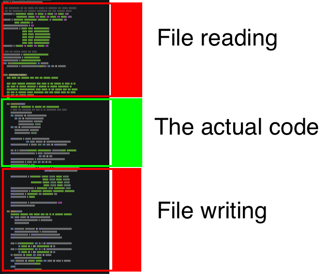

##File formats

Probably the most boring topic on this list.

File input and output takes up a surprising amount of time. Nearly every grad student has attempted to wade through custom formats created by a long-gone postdoc, or struggled with an in-house parsing script that breaks for random reasons. It doesn't have to be this way.

###Does this sound like you?

#####A large portion of your scripts are file reading and writing.

 * You waste a lot of time writing code and chasing down bugs unrelated to publishable work.
 * Even with that time, your file parsing code isn't good enough for you to want to share.
 * Examples:
   - That one script I have where only 10% is actual script.

#####You want to output code results, but your data doesn't fit nicely into a plain text file.

 * A common short-term solution: You end up making your own format, or modifying a format you are familiar with (e.g. molfile, CIF).
   - This leads to long-term headaches.
   - You have to write and maintain code to read / write this data format.
   - You have to explain your format to collaborators, and they will hold you responsible when bugs occur.
   - Scope creep. Adding result terms here and there will gradually complicate your file parsing code. Give it a couple of years, and it will be a 10k-line mess.
 * Examples:
   - That crazy-formatted output file from grad school days.
   - The modified molfiles from the original MOF generator.
   - Charged CIF files from RASPA.

#####File format inconsistencies are a barrier to lab collaboration.

 * With enough short-term fixes, everyone ends up with their own workflow.
 * You end up having to organize meetings (entire meetings!) just to decipher a colleague's work.
 * Examples:
   - Your colleague's code breaks on CIFs with tabs, and your code breaks on CIFs with spaces.
   - Your colleague uses a molfile with custom fields in a notation that only he understands.
   - Your colleague provided functional file parsing code, but it doesn't scale well (e.g. memory leaks, open file descriptors, OS-specific logic).

###The Solution

#####Adopt a standard file format.

 * There are a lot: YAML, TOML, XML, JSON, CSV, pyconfig.
 * **JSON** is today's overwhelming standard.
 * For 99% of you, JSON can cover all of your needs.

###Advantages

#####No more code for file reading and writing!

 * Other people maintain part of your code for you!
 * There are robust JSON parsers baked in to almost every computer language out there.
   * Newer languages support in the standard library.
   * Older languages have packages: `json-fortran`, `json-c`, `json-cpp`, `json-java`, etc.

#####Extensibility - no more custom formats required!

 * JSON was designed to handle arbitrary data.
   * If you find something you can't write in JSON, let me know.

#####Easier collaboration.

 * Handling JSON data is *very* simple.
 * As a larger standard, JSON plays well with modern software.
   * Databases, logging engines, cloud computing, and more.
 * You benefit from a cross-langauge standard.
   * Scenario: You write in Python, a colleague writes in C++, another in Go, another in R.
   * Because you're all inputting and outputting JSON, your language choice doesn't matter.
   * There are more "standard" ways to do this, but this approach gets you a lot of benefit for little work.

###Chemical Data Handling

Many people "think in CIF", and are primarily concerned with getting a CIF out of their work. Instead, think in JSON. It will feel weird at first, but the benefits will accrue over time.

That being said, we still need CIFs. Open Babel can convert JSON into over 100 chemical formats, including CIF. Think in JSON, and convert to CIF with Open Babel only when needed (e.g. Gaussian). As your progress, you will find yourself using CIFs less and less!

####Caveats

As discussed, JSON is a file format. Files should only be used to handle small amounts of data.

 * Rule of thumb: if your output is larger than your computer's memory, look into databases.
   * BSON (binary JSON) is used as the core of many databases (e.g. mongoDB), and behaves almost exactly the same as JSON files. This makes implementing databases much easier.
 * JSON is not storage efficient.
   * My laptop has 1 TB hard drive, which cost me $80. If you're coming close to
     these numbers, you really should be using a database.
