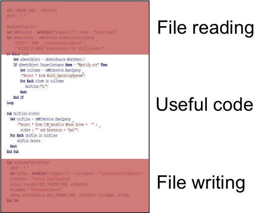
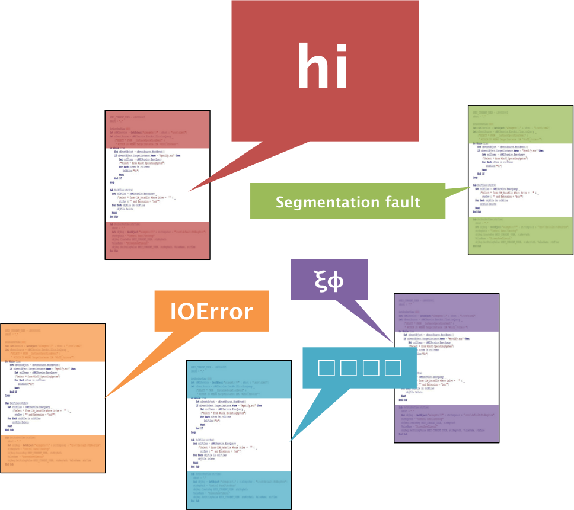

File formats (aka the most boring topic ever)
=============================================

You probably don't think about it, but file input and output takes up a surprising amount of time. Nearly every grad student has attempted to wade through custom formats created by a long-gone postdoc, or struggled with an in-house parsing script that breaks for random reasons. It doesn't have to be this way!

###Does this sound like you?

#####A large portion of your scripts are file reading and writing.

<p align="center">
  
</p>

You start a project to test out a new idea, but have to deal with reading inputs and writing outputs. You may not think about it, but you've spent a lot of time working on code that is *unrelated to publishable work*.

Maybe, even with that time added, your inputs and outputs are still ugly. They're now a custom format that only you understand, and you're hesitant to share your work because of it.

#####You want to output code results, but your data doesn't fit nicely into a plain text file.

So, you adopt an all-too-common short-term solution. You end up making your own format, or modifying a format you are familiar with (e.g. molfile, pdb). Look at the files in [custom_format_examples](custom_format_examples) for real-world examples that we've personally had to handle.

This may fix the problem today, but is a poor long-term solution. This is what we call [technical debt](http://en.wikipedia.org/wiki/Technical_debt), and it's a common symptom of working hard instead of working smart. You may save a couple of hours now, but you will pay that time back with interest due to multiple factors:

 * You have to write and maintain code to read / write this data format.
 * You have to explain your format to collaborators, and they will hold you responsible when bugs occur.
 * [Scope creep](http://en.wikipedia.org/wiki/Scope_creep). Adding result terms here and there will gradually complicate your file parsing code. Give it a couple of years, and it will be a 10k-line mess.

#####File format inconsistencies are a barrier to lab collaboration.

<p align="center">
  
</p>

With enough short-term fixes, everyone ends up with their own workflow. You end up having to organize meetings (entire meetings!) just to decipher a colleague's work. You end up "learning" code quirks (code X breaks when you use tabs, you have to ctrl+alt+del after running code Y, code Z outputs a file that doesn't load into code X). You are concerning yourself with things that are not publishable, educational, or even interesting.

###The solution - look to the broader programming community!

Whenever you feel you're doing something inefficiently, look to solutions adopted by the broadest possible community. Generalize your question as much as possible before going to google. In this case, don't ask "[how do I handle chemical simulation data?](https://www.google.com/webhp?sourceid=chrome-instant&ion=1&espv=2&ie=UTF-8#safe=off&q=how+do+I+handle+chemical+simulation+data%3F)" - that will lead you down a dark path. Instead, ask "[how do I handle arbitrary data?](https://www.google.com/webhp?sourceid=chrome-instant&ion=1&espv=2&ie=UTF-8#q=how%20do%20i%20handle%20arbitrary%20data)". This will lead you to solutions tested by communities *significantly* larger than our own. In fact, googling that exact phrase leads us to the right solution: [JSON](http://www.copterlabs.com/blog/json-what-it-is-how-it-works-how-to-use-it/).

Let's take a step back and talk about file formats. Like you, many programmers have needed to read and write data to files. They've done it so much that they have adopted data exchange standards, and they've become so prevalent that many languages support them in their standard library. There are a lot of standards out there: [YAML](http://symfony.com/doc/current/components/yaml/yaml_format.html), [TOML](https://github.com/toml-lang/toml), [XML](http://www.w3schools.com/xml/), [JSON](http://www.w3schools.com/json/), [CSV](http://en.wikipedia.org/wiki/Comma-separated_values), and more. Most of us are okay with CSV data; custom file formats seem to arise only when our data doesn't fit nicely into a spreadsheet. All of the other above formats could be used to fix this, but JSON is the dominant standard due to its simplicity and ubiquity.

###A common scenario

Your data doesn't fit into a CSV, so you're going to reappropriate a molfile to hold values. You've used molfiles before, and, even though you haven't read through [the 100-page spec](http://c4.cabrillo.edu/404/ctfile.pdf), you feel confident that you can throw something together. You'll need code to read and write the data, documentation to explain usage to collaborators, and development time to address bugs as they pop up. If your code gets even a moderate amount of use, you'll end up having to read that spec.

One of your colleagues only works in C++, another in R, another in Julia, and another in Go. If they want to collaborate, they have to write code to parse your custom format, and now *they're* on the hook to maintain non-publishable code.

Your colleagues immediately understand the format, and don't have to write any custom code to handle your format. The Go and Julia colleagues can use their standard lib, and the C++ and R coders can use their respective package managers to quickly install the functionality.

###An example

To show how we can quickly load and unload data between languages, let's create a json file with python, and then load and unload it in a couple of other languages. Running each version in order reads a json file, edits the data, and writes it as output.

```
python step_1.py
ruby step_2.py
node step_3.js
g++ step_4.cpp -o step_4 && ./step_4  # I used boost
julia step_5.jl
```

Look through the files, and you'll see that they're all very short. With a couple of lines of code, you now have a format that is generalizable to any type of data in any language.


###The advantages, in list form

<p align="center">
  
</p>

#####No more code for file reading and writing!

 * Other people maintain the code that handles it.
 * There are robust JSON parsers baked in to almost every computer language out there.
   * Newer languages support in the standard library.
   * Older languages have packages: `json-fortran`, `json-c`, `json-cpp`, `json-java`, etc.

#####Extensibility - no more custom formats required!

 * JSON was designed to handle arbitrary data.
   * If you find something you can't write in JSON, let me know.

#####Easier collaboration.

 * Handling JSON data is *very* simple.
   * You've already learned it!
 * As a larger standard, JSON plays well with modern software.
   * Databases, logging engines, cloud computing, and more.
   * Even your text editors have json support!
 * You benefit from a cross-langauge standard.

###Applying this to computational chemistry

Having worked with chemicals, many of us have learned [literally hundreds](http://openbabel.org/docs/dev/FileFormats/Overview.html) of chemical file formats: mol, pdb, cif, smiles, sdf, car, etc. When people in the field hear of extensible formats like JSON, they view them simply as more formats to learn. Don't do this! The entire idea of these formats is to *avoid* wasting time learning about their nuances.

Another common misconception is that JSON is a competitor to the chemical file formats. That is not at all the case, and they actually benefit from being used together. For example, here's a JSON string that contains a smiles, an inchi, and a chemical name.

```json
{
  "inchi": "InChI=1S/C6H6/c1-2-4-6-5-3-1/h1-6H",
  "name": "benzene",
  "smiles": "c1ccccc1"
}
```

Finally, your code probably requires reading/writing chemical files. That's completely fine, but don't write and support your own parser. Use a library like [open babel](http://openbabel.org/wiki/Main_Page) to handle the chemical formats. Keep your code simple, and you'll never have to read that molfile spec.

####And finally, don't abuse files!

As discussed, JSON is a *file* format. Files should only be used to handle small amounts of unrelated data.

If your output is on the same order of magnitude as your computer's memory, you should be using a database. If you have a folder with files labeled sequentially, you should be using a database. If you have hundreds of files organized with a file naming scheme, you should be using a database.

Luckily, BSON (binary JSON) is used as the core of many databases (e.g. [mongoDB](http://www.mongodb.com/what-is-mongodb)), and behaves almost exactly the same as JSON files. This makes implementing databases much easier. For data that fits well into spreadsheets, a [SQL](http://en.wikipedia.org/wiki/SQL) analog will do the trick. For cases where a full database feels like overkill, look at binary formats like [HDF5](http://www.hdfgroup.org/HDF5/).
