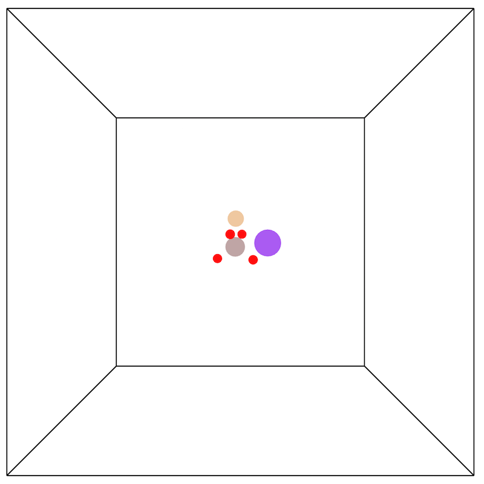
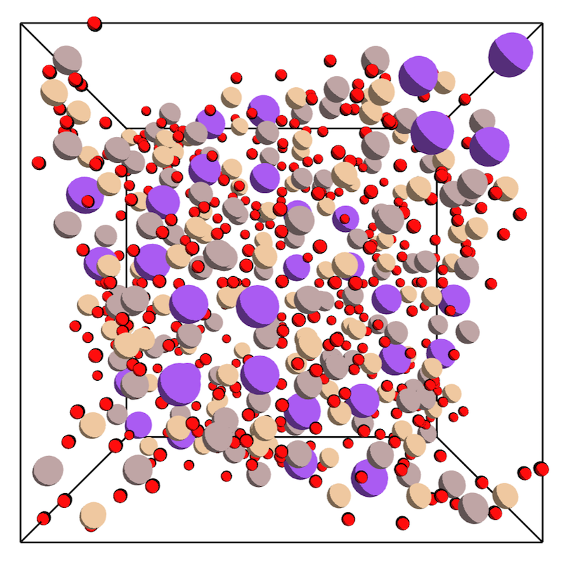

Profiling and Optimization
==========================

There is a considerable amount of discussion about "optimizing" code. This leads to one under-addressed question: how do you optimize your code?

The most common answer is to write your code in a compiled language like C or Fortran. For good measure, some people suggest random code patterns that they heard from someone at some point somewhere (writing out powers as multiplication, custom algorithms for basic operations, etc.).

How do you know these are helping? Can you quantify benefits? Are you limited by CPU, memory, cache, IO? Are your new algorithms truly making an impact, or are they useless micro-optimizations?

> "The real problem is that programmers have spent far too much time worrying about efficiency in the wrong places and at the wrong times; **premature optimization is the root of all evil** (or at least most of it) in programming."

> [Donald Knuth](http://en.wikipedia.org/wiki/Donald_Knuth)

###A more scientific approach

In order to optimize code, we need a good workflow. We need to be able to quantify speed bottlenecks, understand how speed relates to algorithmic complexity, and sort optimization projects by effectiveness - all before touching the code. Let's do this through an example: unpacking crystal structures. *It's hard to write good examples for optimization - please bear with us!*

To avoid having to talk about file i/o, we'll use json (for those interested, I've also included the source cifs). The json representation looks like:

```json
{
  "atoms": [
    {"element": "Si", "location": [0.1, 0.2, 0.3]},
    {"element": "Si", "location": [0.4, 0.5, 0.6]}
  ],
  "symmetry": [
    "x,y,z",
    "x,1/2+y,1/2+z"
  ],
  "unitcell": [
      [ 25.0,  0.0,  0.0 ],
      [  0.0, 25.0,  0.0 ],
      [  0.0,  0.0, 25.0 ]
  ]
}
```

I've stripped out a lot of data from the original file so we can focus solely on the properties of interest. In more detail:

| Property | Details |
| --- | --- |
| element | The atomic element. |
| location | Atom location *in fractional coordinates*. Should be in [0, 1]. |
| symmetry | Operators required to "unpack" crystal. More on this below. |
| unitcell | A matrix representing the basic repeating unit of the crystal. You can convert atom locations with it: `cartesian = unitcell · fractional`. |

The crystal as is looks pretty boring.

<p align="center">
 
</p>

We need to "unpack" the crystal to get a complete list of atoms. We do this by applying looping through the symmetry operators and the atoms, filling the unit cell.

<p align="center">
 
</p>

In pseudocode:

```python
unpacked_atoms = []
for atom in atoms:
    for operator in symmetry:
        # Apply operator to atom location
        unpacked_atoms.append(atom)
```

This is the gist of the algorithm, but we need to account for one major real-world issue: many packed crystal files are malformed. They commonly contain extra atoms or symmetry operators, so we need to account for this. The solution is to detect collisions as you unpack. To do this, we will need to add a step to the pseudocode:

```python
unpacked_atoms = []
for atom in atoms:
    for operator in symmetry:
        # Apply operator to atom location
        if atom is not colliding:
            unpacked_atoms.append(atom)
```

Let's start with a basic approach - we'll check the distance between atoms as we unpack. A functional version of this can be found in [unpack_v1.py](/optimizationoptimization/unpack_v1.py) and run with `python unpack_v1.py crystal.json`.

###A mental model: Big O notation

Before diving into the tools, we need to develop a basic mental model. In algorithms, the quick-and-dirty approach is called [big O notation](http://en.wikipedia.org/wiki/Big_O_notation). We use this by ignoring most of the code and looking at the loop structure. Let's break down [unpack_v1.py](optimization/unpack_v1.py) into its loops.

```python
for operation in packed_crystal["symmetry"]:
    # Stuff
    for atom in packed_crystal["atoms"]:
        # More stuff
        for unique_atom in unpacked_atoms:
            # Even more stuff
```

We have three loops: `symmetry`, `atoms`, and `unpacked_atoms`. The inner loop will run a lot (the product of these three lists, to be exact). In Big O notation, we want to make some rough approximations to determine how this loop scales with the size of input.

In the worst case, the length of `unpacked_atoms` will be the product of the lengths of `symmetry` and `atoms`. Let's call this value *n*. Remembering we're roughly approximating, this means that the inner loop will get called as many as *0.5n<sup>2</sup>* times. In big O notation, we drop all but the highest-level operators. This algorithm is *O(n<sup>2</sup>)*. This is a huge red flag - algorithm time increases with the square of the number of atoms and symmetry operators! This means that, while the algorithm may work fine on a small scale, it will fail spectacularly on large crystals.

###A practical tool: Profilers

Moving on to the pragmatic, it would be interesting to know exactly how many loops are occurring, and exactly how long the program is spending on each line of code. As a first pass, you may have tried to do something like this by using the `time` command and littering print statements throughout your code. If you've done this, then you're going to love [profilers](http://en.wikipedia.org/wiki/Profiling_%28computer_programming%29). We'll use them below.

###Mental model + practical tool = science

Previously, we decided that the current algorithm will perform okay on small structures, but fail at larger scales. Let's test out this theory. In this repository are two crystals, [zeolite.json](/zeolite.json) and [large_crystal.json](/large_crystal.json). The zeolite has about 5 atoms and 100 symmetry operators, meaning we should expect something around 250,000 operations. Let's see how accurate we are by using python's built-in profiler.

```
▶ python -m cProfile -s time unpack_v1.py zeolite.json
197190 function calls (197091 primitive calls) in 0.189 seconds
Ordered by: internal time

ncalls  tottime  percall  cumtime  percall filename:lineno(function)
1       0.139    0.139    0.176    0.176   unpack_v1.py:10(unpack)
672     0.021    0.000    0.022    0.000   {built-in method eval}
191920  0.014    0.000    0.014    0.000   {built-in method sqrt}
1       0.004    0.004    0.004    0.004   {built-in method print}
```

This shows you the number of times functions were called, and how much time the program spent in various parts. The right-hand column attempts to identify where it is. A lot of it tends to read like gibberish, but the important steps are generally easy to figure out. The program spent 0.176 out of 0.189 seconds in the `unpack` function, so it's the function we should be looking to optimize. The square root function was called 191,920 times, which means that we weren't too far off with our estimate of 250,000 loops.

Here are the profiler property descriptions, as stated in the [python documentation](https://docs.python.org/3.4/library/profile.html):

| column | description |
| --- | --- |
| ncalls | for the number of calls |
| tottime | for the total time spent in the given function (and excluding time made in calls to sub-functions) |
| percall | is the quotient of tottime divided by ncalls |
| cumtime | is the cumulative time spent in this and all subfunctions (from invocation till exit). This figure is accurate even for recursive functions. |
| percall | is the quotient of cumtime divided by primitive calls |
| filename:lineno(function) | provides the respective data of each function |

Time to test the theory. With about 3,000 atoms and 50 symmetry operators, our big O mental model suggests that the large crystal should take as many as *22,500,000,000* operations!

```
▶ python -m cProfile -s time unpack_v1.py large_crystal.json
2401060415 function calls (2401060316 primitive calls) in 5018.713 seconds
Ordered by: internal time

ncalls     tottime  percall  cumtime  percall  filename:lineno(function)
1          4823.004 4823.004 5018.893 5018.893 unpack_v1.py:10(unpack)
2400689408 185.868  0.000    185.868  0.000    {built-in method sqrt}
169728     9.543    0.000    9.740    0.000    {built-in method eval}
169728     0.276    0.000    0.276    0.000    unpack_v1.py:19(<listcomp>)
```

Let's clean up those numbers: *2,400,689,408 loops in 1.39 hours*. All things considered, our mental model was a decent approximation.

###*Always* question the algorithm

If you remember one thing from this tutorial, make it this: **If you are optimizing O(n<sup>2</sup>) code, look for an O(n log(n)) solution**. In comparison, anything else you do will look like a micro-optimization.

We won't get in to the details, but *O(n log(n))* is commonly achieved through [binary trees](http://en.wikipedia.org/wiki/Binary_tree) or [hash tables](http://en.wikipedia.org/wiki/Hash_table). In [unpack_v2.py](optimization/unpack_v2.py), we have replaced the inner loop with a hash table (a `set` in python). Let's profile.

```
▶ python -m cProfile -s time unpack_v2.py zeolite.json
6270 function calls (6171 primitive calls) in 0.044 seconds
Ordered by: internal time

ncalls  tottime  percall  cumtime  percall filename:lineno(function)
672     0.021    0.000    0.021    0.000   {built-in method eval}
1       0.005    0.005    0.005    0.005   {built-in method print}
1       0.003    0.003    0.028    0.028   unpack_v2.py:9(unpack)
750     0.003    0.000    0.003    0.000   {method 'format' of 'str' objects}
```
```
▶ python -m cProfile -s time unpack_v2.py large_crystal.json
544511 function calls (544412 primitive calls) in 5.553 seconds
Ordered by: internal time

ncalls  tottime  percall  cumtime  percall filename:lineno(function)
169728    4.257    0.000    4.377    0.000 {built-in method eval}
169806    0.561    0.000    0.561    0.000 {method 'format' of 'str' objects}
1         0.533    0.533    5.660    5.660 unpack_v2.py:9(unpack)
169728    0.184    0.000    0.184    0.000 unpack_v2.py:19(<listcomp>)
```

This simple algorithm change resulted in a 4.3x speed improvement on the small crystal, and a staggering **900x improvement** for the large crystal!

###Let the profiler tell you where to optimize

The algorithm is the main driver of performance, but the profiler output usually suggests other functions to rework. In this case, most of our time is eaten up by the built-in function `eval`. This function is known to be poor choice for a [number of reasons](http://stackoverflow.com/questions/86513/why-is-using-the-javascript-eval-function-a-bad-idea), and should generally be avoided. The [unpack_v3.py](optimization/unpack_v3.py) code replaces `eval` with a built-in algorithm. Let's see how this change affects performance.

```
▶ python -m cProfile -s time unpack_v3.py zeolite.json
10966 function calls (10867 primitive calls) in 0.018 seconds
Ordered by: internal time

ncalls  tottime  percall  cumtime  percall filename:lineno(function)
672     0.008    0.000    0.010    0.000   unpack_v3.py:9(apply_symmetry)
750     0.002    0.000    0.002    0.000   {method 'format' of 'str' objects}
1       0.002    0.002    0.014    0.014   unpack_v3.py:29(unpack)
672     0.001    0.000    0.001    0.000   unpack_v3.py:11(<dictcomp>)
```
```
▶ python -m cProfile -s time unpack_v3.py large_crystal.json
1732606 function calls (1732507 primitive calls) in 2.530 seconds
Ordered by: internal time

ncalls  tottime  percall  cumtime  percall filename:lineno(function)
169728  1.721    0.000    2.065    0.000   unpack_v3.py:9(apply_symmetry)
169806  0.492    0.000    0.492    0.000   {method 'format' of 'str' objects}
1       0.376    0.376    2.937    2.937   unpack_v3.py:29(unpack)
169728  0.121    0.000    0.121    0.000   unpack_v3.py:11(<dictcomp>)
```

###A quick boost: optimized compilers

Better compilers are a quick way to get another boost. Without rewriting any code, we can tools such as [pypy](http://pypy.org/) to bring down that time. You can install pypy and run with `pypy unpack_v3.py large_crystal.json`. The speed results are included in the table at the end of this document.

###Moving key components to a low-level language

At this point, it seems we've gotten about as much performance as we can get out of python. Now, with the algorithms in place, we should start looking at the compilers and languages for optimization.

For more speed, we should rewrite portions of the code in a low-level language like C. A best practice is to *only rewrite the speed bottlenecks*. Keep your basic stuff in a high-level language, and then call low-level functions for the fast parts. The reason is simple: C code takes more time to maintain properly. Whenever you "drop down" code to a low-level language, be sure that the performance benefit is worth the long-term maintenance cost.

With that caveat in mind, let's look at an example. The [unpack_v4.c](/unpack_v4.c) file is a rewrite of `applySymmetry`, and [unpack_v4.py](/unpack_v4.py) shows how to call this function from python. With this "drop down", our performance further improves:

```
▶ gcc -shared -o unpack.so -fPIC -O3 unpack_v4.c
```
```
▶ python -m cProfile -s time unpack_v4.py zeolite.json
6540 function calls (6429 primitive calls) in 0.015 seconds
Ordered by: internal time

ncalls  tottime  percall  cumtime  percall filename:lineno(function)
1       0.005    0.005    0.008    0.008   unpack_v4.py:22(unpack)
787     0.002    0.000    0.002    0.000   {method 'format' of 'str' objects}
33      0.001    0.000    0.001    0.000   {built-in method __build_class__}
2       0.001    0.000    0.001    0.000   {built-in method load_dynamic}
```
```
▶ python -m cProfile -s time unpack_v4.py large_crystal.json
383412 function calls (383301 primitive calls) in 1.560 seconds
Ordered by: internal time

ncalls  tottime  percall  cumtime  percall filename:lineno(function)
1       1.047    1.047    1.543    1.543   unpack_v4.py:22(unpack)
169843  0.422    0.000    0.422    0.000   {method 'format' of 'str' objects}
169728  0.069    0.000    0.069    0.000   {method 'encode' of 'str' objects}
1       0.007    0.007    0.007    0.007   decoder.py:349(raw_decode)
```

###In summary

Here are our version runs in one convenient table:

| file | zeolite run time (s) | large crystal run time (s) |
| --- | --- | --- |
| unpack_v1.py | 0.189 | 5018.713 |
| unpack_v2.py | 0.044 | 5.553 |
| unpack_v3.py | 0.018 | 2.530 |
| unpack_v3.py (pypy) | 0.143 | 1.567 |
| unpack_v4.py (c) | 0.015 | 1.560 |

There should be two takeaways here:

  1. Optimize scientifically.
  2. Algorithms matter.

If you have any questions, please let us know by [opening an issue](https://github.com/patrickfuller/fomms-2015/issues)!
