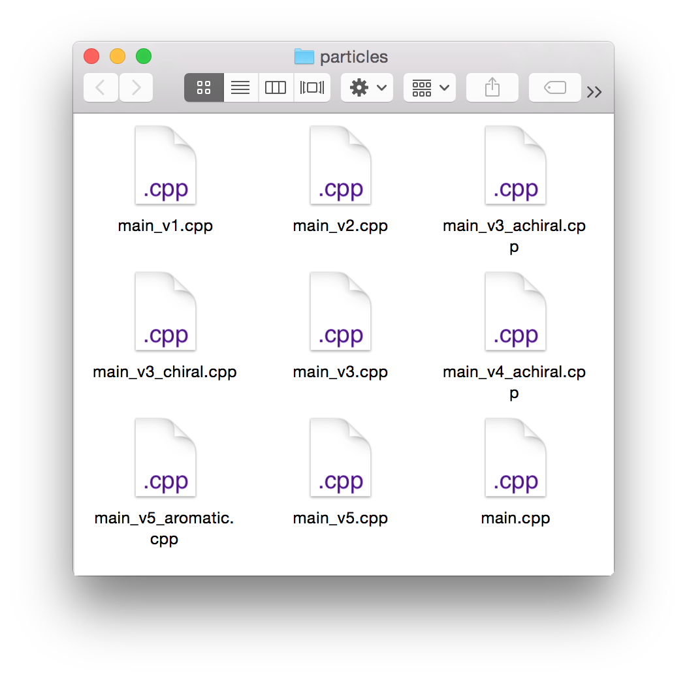

Version control (Git) and remote collaboration (Github)
=======================================================

From [Why should I use version control?](http://stackoverflow.com/questions/1408450/why-should-i-use-version-control):

> Have you ever:

> * Made a change to code, realised it was a mistake and wanted to revert back?
* Lost code or had a backup that was too old?
* Had to maintain multiple versions of a product?
* Wanted to see the difference between two (or more) versions of your code?
* Wanted to prove that a particular change broke or fixed a piece of code?
* Wanted to review the history of some code?
* Wanted to submit a change to someone else's code?
* Wanted to share your code, or let other people work on your code?
* Wanted to see how much work is being done, and where, when and by whom?
* Wanted to experiment with a new feature without interfering with working code?

> In these cases, and no doubt others, a version control system should make your life easier.

> To misquote a friend: A civilised tool for a civilised age.

My personal experience is inheriting projects that look like this:

  

Which version do you use? What are the differences between versions, and *why* were the changes made? Do any have useful functionality that's not in the main version? Version control cleans this mess up, and offers a host of other useful features.

Git is the standard, and, like json, there are *so many* users that you can find tutorials everywhere. Here is a curated list:

 * [An entire section in Software Carpentry](http://software-carpentry.org/v5/novice/git/index.html) and [the corresponding git repo](https://github.com/swcarpentry/boot-camps/tree/master/version-control/git/local)
 * [A tutorial written by the founder of Github](http://git-scm.com/doc)
 * [A three-hour youtube video explaining git, Github, and science](https://www.youtube.com/watch?v=T0BE9ApIegc)
 * [A stack overflow post on git for beginners](http://stackoverflow.com/questions/315911/git-for-beginners-the-definitive-practical-guide)
 * [An interactive web app for learning git, by Github](https://try.github.io/levels/1/challenges/1)
 * [A git tutorial as a lesson in a scientific programming tutorial](http://nbviewer.ipython.org/github/jrjohansson/scientific-python-lectures/blob/master/Lecture-7-Revision-Control-Software.ipynb)

######TODO Although the listed tutorials are going to be better than what we write, we should still showcase basic git functionality
